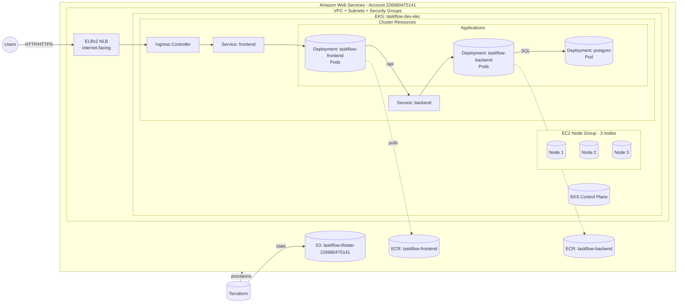

## Taskflow Architecture (AWS + EKS)

This diagram shows how Terraform-provisioned AWS resources, EKS, and your Kubernetes workloads fit together.

### How to read this
- Users reach the internet-facing NLB created by Kubernetes `Ingress`/`Service` of type `LoadBalancer`.
- The Ingress forwards to the frontend `Service`/Pods; the frontend calls the backend `Service`.
- The backend talks to Postgres running inside the cluster (swap to RDS later if needed).
- Docker images are stored in ECR and pulled by the cluster when Pods start.
- Terraform provisions AWS (EKS, VPC, ECR, IAM, etc.) and stores state in S3 for team consistency.

